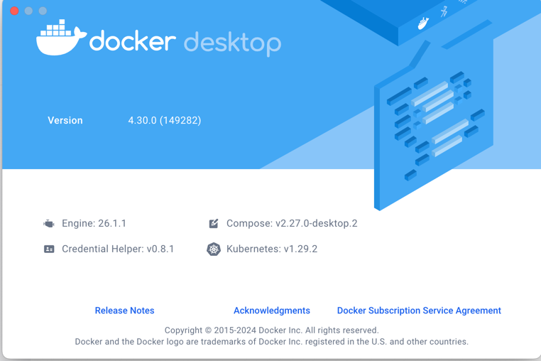
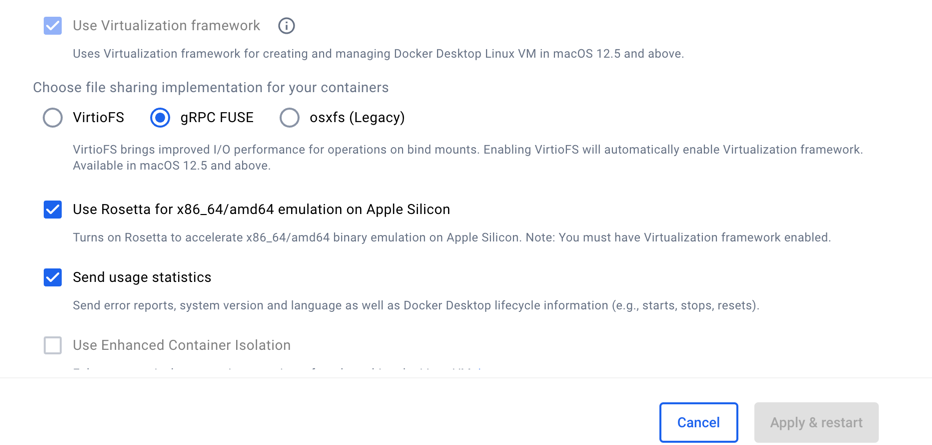
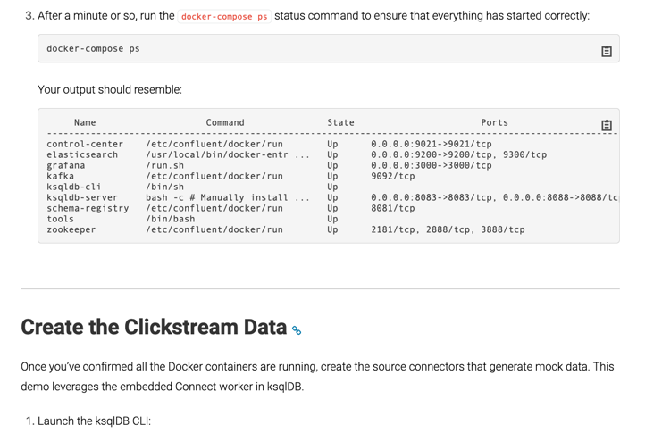

# Hello! 

# INTRO:
### This branch is part of:
`https://github.com/confluentinc/examples.git`
### It only contains "clickstream" and "utils" directories from original repository

### Versions used:
> Branch: 7.5.0 ( https://github.com/confluentinc/examples.git -> 7.5.0 branch )
>Docker Desktop: 4.30.0 (149282)
>Docker: Engine: 26.1.1
>DockerCompose: v2.27.0-desktop.2

### If you look for your DockerDestkop versions.
#### They are in "About" section of your DockerDesktop software

# If u are M[1/2/3] (MacOsX) + DockerDesktop user,
# use this options for Rosetta virtualization
>#### This repo was tested on this settings:

# Run 
> cd clickstream
> docker-compose up

# After running `docker-compose up` please follow: 
https://docs.confluent.io/platform/current/tutorials/examples/clickstream/docs/index.html
# 
### Run `docker-compose ps`
### and continue with rest of the tutorial

# TROUBLESHOOTING:
### 1. Sometimes because of race condition one of Services is not running. Run:
>`docker-compose up` again. It might help.
### 2. If there is a notification that some ports are busy/taken/unavailable:
> `rerun DockerDesktop software` -> this was number 1 case of ports being taken most of the time

> before running docker-compose up -> `kill all services and processes that are hijacking your ports`

IMPORTANT: If u are killing process on port, process might get recreated right away.
Thats  why its important to know that 
services control creating and maintaining processes on some ports